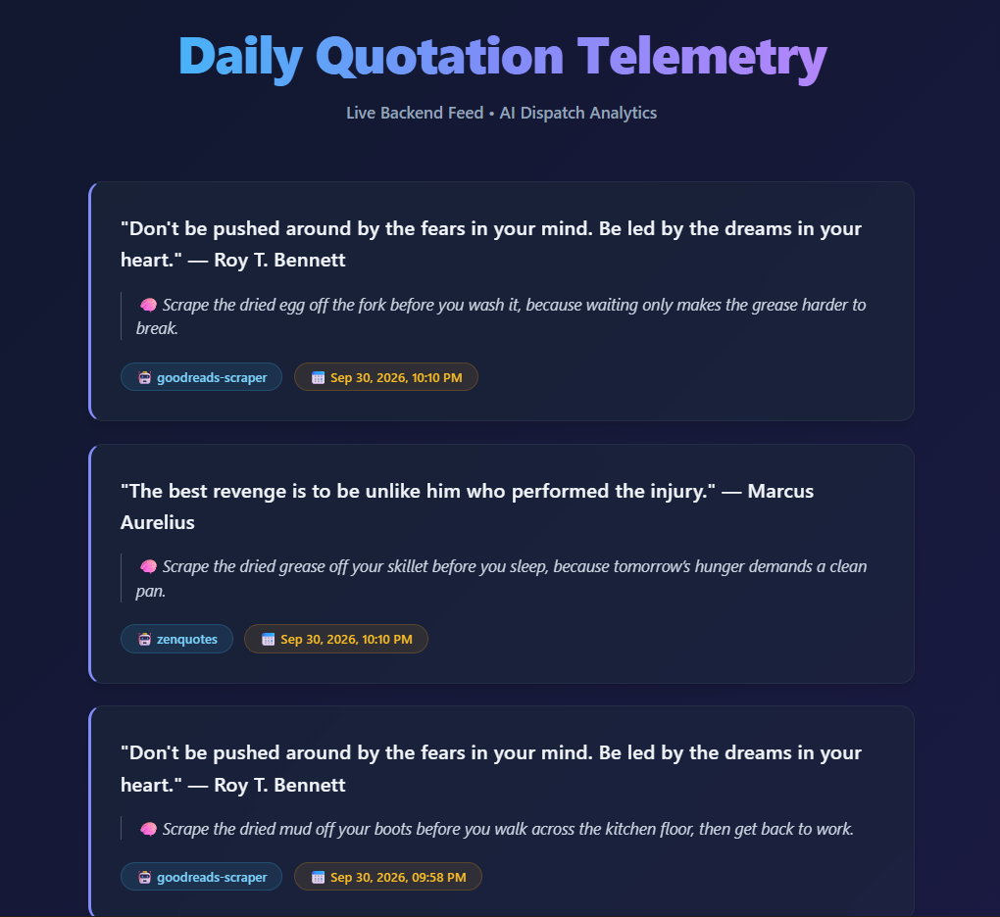

# 🧠 Daily Maxim - AI Telegram Motivation Bot & Telemetry Suite(@ChiefMotivationbot)

A full-stack, production-ready Telegram motivation bot ecosystem that delivers famous historical quotes and AI-driven reflections directly to users while broadcasting live telemetry to an analytics dashboard.



## 🚀 Key Features

- **Historical Quote Engine:** Fetches famous historical maxims with author attribution via multi-source provider rotation (ZenQuotes API, Quotable API, Web Scrapers) with local `quotes.json` fallback guarantee.
- **Grounded AI Reflection Engine:** Powered by Google's `gemini-3.5-flash-lite` with safety filters tuned for raw, pragmatic, and authentic wisdom.
- **Dynamic Modalities:** Randomized Spectrum Engine rotating between _Raw Reality_, _Deep Observation_, _Quiet Compassion_, and _Pragmatic Action_.
- **Real-time Telemetry Dashboard:** Vite/React glassmorphic dashboard hosted on Vercel polling live execution stats (source model, A/B variant, API latency).
- **Automated Dispatch System:** Flexible `node-cron` scheduling for Morning (8 AM), Midday (1 PM), Evening (6 PM), and Weekly dispatches with timezone awareness (`Asia/Kolkata`).
- **Resilient Multi-Tier Fallback:** Instant memory caching and local JSON fallback sequences to ensure 100% uptime even during upstream outages.
- **Gamification & Leaderboards:** Streak tracking, milestone rank badges, and anonymous global leaderboards.
- **Continuous Availability:** GitHub Actions workflow issuing keep-alive pings to prevent free-tier server sleeping.

## 🛠️ Architecture & Tech Stack

- **Backend:** Node.js, Express.js, `node-telegram-bot-api`, `node-cron`
- **Frontend:** React, Vite, CSS Glassmorphism
- **AI Integration:** Google Generative AI SDK (`gemini-3.5-flash-lite`)
- **Historical Quote Sources:** ZenQuotes API, Quotable API, Goodreads Scraper, `quotes.json`
- **DevOps & CI/CD:** GitHub Actions (Keep-Alive Cron), Render (Express Web Service), Vercel (Static Edge Deployment)

## ⚙️ Environment Variables

Create a `.env` file in the root directory:

```env
PORT=3000
TELEGRAM_BOT_API_TOKEN=your_telegram_bot_token
GEMINI_API_KEY=your_gemini_api_key
TELEGRAM_CHAT_ID=your_admin_chat_id
WEBHOOK_SECRET=your_custom_webhook_secret
IS_TEST_MODE=false
```

## 🧪 Local Setup

Clone the Repository:

```bash
git clone https://github.com/starJeet000/Telegram-Daily-Motivation-Bot.git
cd Telegram_Daily_Motivation_Bot
npm install
```

Start the Backend Server & Bot:

```bash
npm start
```

Run the React Dashboard locally:

```bash
cd motivation-dashboard
npm install
npm run dev
```

## 📡 API Endpoints

| Method | Endpoint                 | Description                                            |
| ------ | ------------------------ | ------------------------------------------------------ |
| GET    | `/api/quotes/latest`     | Serves the last 7 generated quotes with telemetry data |
| POST   | `/api/webhook/broadcast` | Protected endpoint for external system alerts          |

## 📜 License

Distributed under the MIT License.
